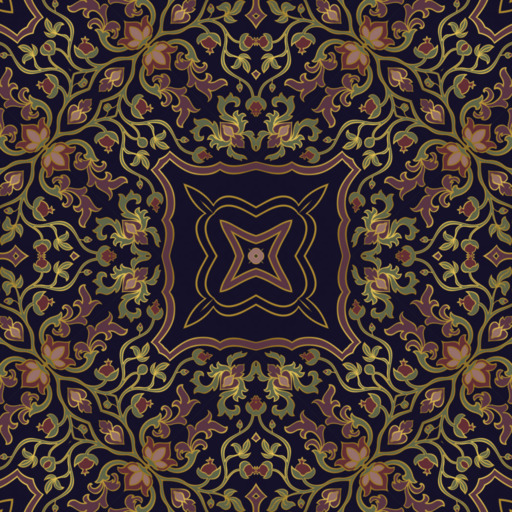
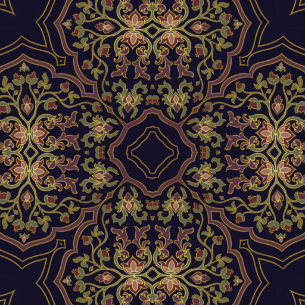
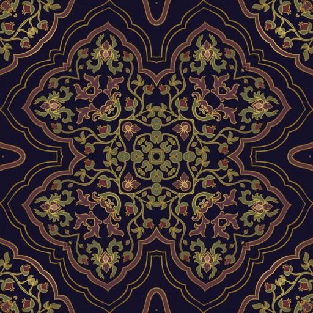
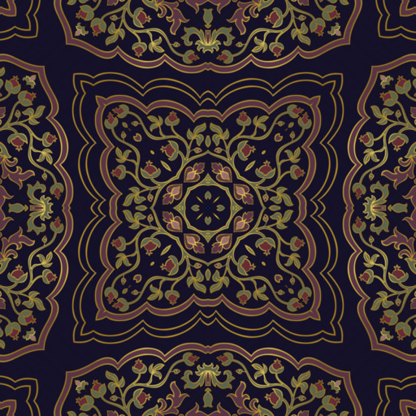
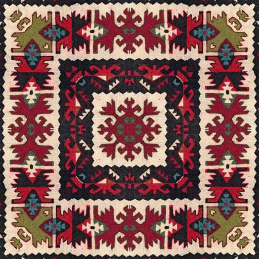
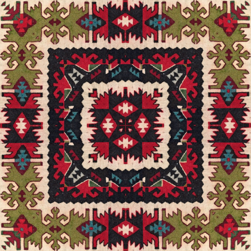

# HTML5 Mandala Maker
[](https://github.com/ArtBIT/html5-mandala) [](https://github.com/ArtBIT/html5-mandala)  [](https://github.com/ArtBIT/html5-mandala)

This is a tiny web app that generates mandalas from images using radial symmetry,

# Demo
Try out the live demo http://artbit.github.io/html5-mandala/


# Examples
 
 
 
 
 
 
 
 
 


# Running it locally
```
git clone https://github.com/ArtBIT/html5-mandala.git
cd html5-mandala
npm run dev
open public/index.html
```

# License

[MIT](LICENSE.md)
