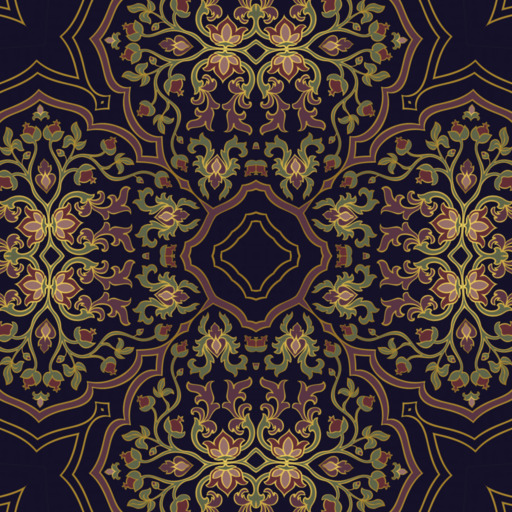
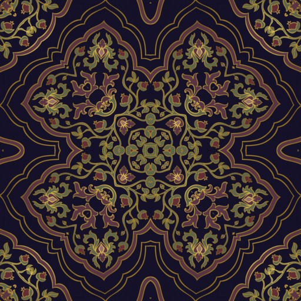
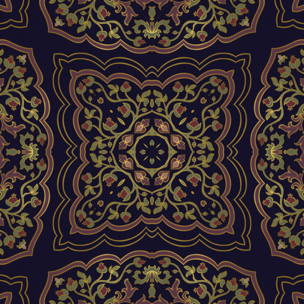
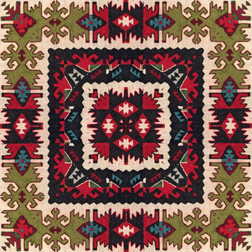

# HTML5 Mandala Maker
[](https://github.com/ArtBIT/html5-mandala) [](https://github.com/ArtBIT/html5-mandala)  [](https://github.com/ArtBIT/html5-mandala)

An interactive web app that generates mandalas from images using radial symmetry, with a full timeline animation editor.

# Demo
Try out the live demo https://artbit.github.io/html5-mandala/

# Features

- **Radial Symmetry Rendering** - Generate mandala patterns from any image with configurable symmetry count
- **Timeline Keyframe Editor** - Canvas-based timeline with drag-and-drop keyframes for animating parameters
- **Bezier Curve Easing** - Custom easing curves with visual bezier editor, plus 13 built-in easing presets
- **10 Built-in Animation Presets** - Ready-to-use animations (Slow Spin, Kaleidoscope Drift, Hypnotic Vortex, Cosmic Bloom, and more)
- **Undo/Redo** - Full history system with Ctrl+Z / Ctrl+Y support
- **Auto-Save** - Automatic state persistence to localStorage
- **Keyboard Shortcuts** - Space (play/pause), arrow keys (frame navigation), Delete (remove keyframes), and more
- **Resizable Panels** - Adjustable layout with collapsible controls and timeline panels
- **Export** - PNG image export and WebM video export with quality/FPS controls
- **Tileable Patterns** - Option to make source patterns seamlessly tileable
- **Interactive Canvas** - Drag to adjust offset, Shift+drag for angle, Alt+drag for pattern angle, scroll to zoom

# Examples








# Running it locally
```
git clone https://github.com/ArtBIT/html5-mandala.git
cd html5-mandala
npm install
npm run dev
```

# Tech Stack

- [React](https://react.dev/) - UI framework
- [Zustand](https://zustand.docs.pmnd.rs/) - State management
- [Tailwind CSS](https://tailwindcss.com/) - Styling
- [Vite](https://vite.dev/) - Build tool
- [TypeScript](https://www.typescriptlang.org/) - Type safety

# License

[MIT](LICENSE)
